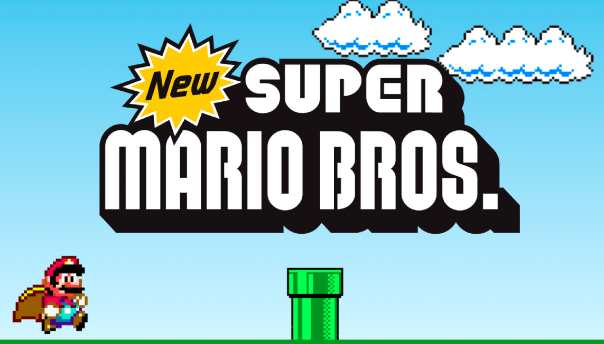
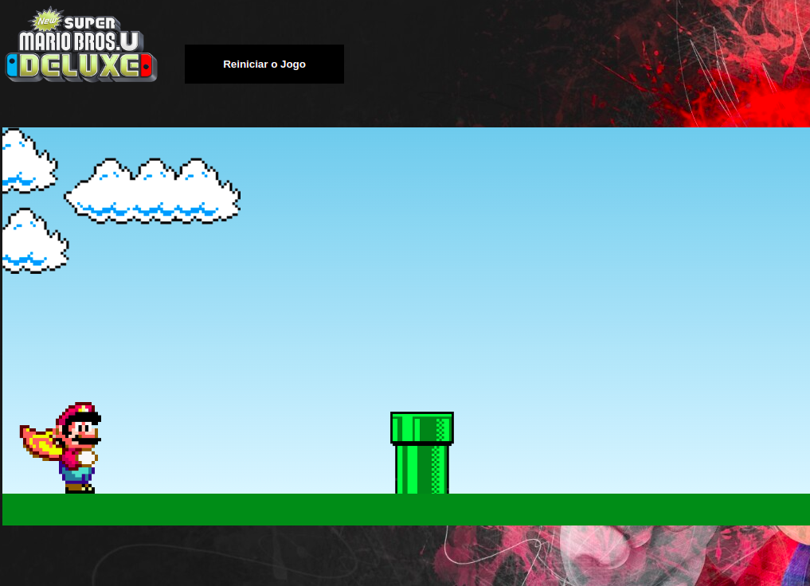

# mario-bros-game   

**Projeto gamer utilizando HTML, JS e CSS do jogo do Mario Bros.**

## **Executar o Game**

-   Abrir o arquivo **mario-bros-game/index.html** no seu navegador.
-   Outra opção e ativar a extensão Live Server do vscode e start server local acessando atraves do endereço http://127.0.0.1:5500/

## Itens para evoluir

-   De acordo com o tempo ir acelerando a velocidade
    -   FEITO
-   Adicionar um score com a pontuação
-   Alternar os objetos pipe adicionando dificuldade

## **Links**

-   [Repo Imagens](https://drive.google.com/drive/folders/1CYQ2CtPyiXcONexGfpQ1RnaPa30c7PNy)
-   [Extensão VsCode Live Server](https://github.com/ritwickdey/vscode-live-server-plus-plus)
-   [Badges README](https://simpleicons.org/)

---

